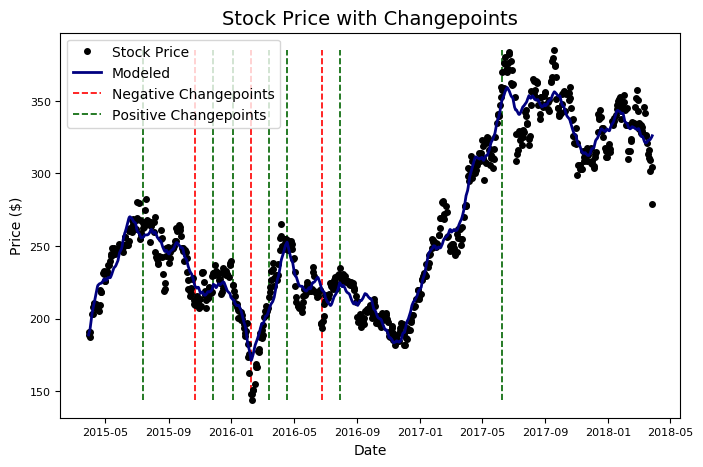

```python
# Developing Algorithmic Trading Strategies Project
Data Science Practicum I
MSDS692, John Holub

EDA to determine up and down market changepoint dates using fbprophet and stocker. These dates will be used to evaluate system viability in up/down market conditions.
```

Install and update libaries


```python
pip install -U quandl numpy pandas fbprophet matplotlib pytrends pystan plotly yfinance
```


```python
# Command for plotting in the notebook
import matplotlib.pyplot as plt
import yfinance as yf 
%matplotlib inline
```


```python
from stocker import Stocker
```


```python
# Use this code for Quandl WIKI stocks (no ETFs)
tesla = Stocker(ticker='TSLA')
```

    TSLA Stocker Initialized. Data covers 2010-06-29 00:00:00 to 2018-03-27 00:00:00.
    


```python
# Use this code for yahoo stocks and ETFs, must supply dates
SPY = yf.download('SPY','2009-01-01','2019-01-01')
```

    [*********************100%***********************]  1 of 1 completed
    


```python
stock_history = tesla.stock
stock_history.head(10)
```


<div>
<style scoped>
    .dataframe tbody tr th:only-of-type {
        vertical-align: middle;
    }

    .dataframe tbody tr th {
        vertical-align: top;
    }

    .dataframe thead th {
        text-align: right;
    }
</style>
<table border="1" class="dataframe">
  <thead>
    <tr style="text-align: right;">
      <th></th>
      <th>Date</th>
      <th>Open</th>
      <th>High</th>
      <th>Low</th>
      <th>Close</th>
      <th>Volume</th>
      <th>Ex-Dividend</th>
      <th>Split Ratio</th>
      <th>Adj. Open</th>
      <th>Adj. High</th>
      <th>Adj. Low</th>
      <th>Adj. Close</th>
      <th>Adj. Volume</th>
      <th>ds</th>
      <th>y</th>
      <th>Daily Change</th>
    </tr>
  </thead>
  <tbody>
    <tr>
      <th>0</th>
      <td>2010-06-29</td>
      <td>19.0000</td>
      <td>25.0000</td>
      <td>17.54</td>
      <td>23.89</td>
      <td>18766300.0</td>
      <td>0.0</td>
      <td>1.0</td>
      <td>19.0000</td>
      <td>25.0000</td>
      <td>17.54</td>
      <td>23.89</td>
      <td>18766300.0</td>
      <td>2010-06-29</td>
      <td>23.89</td>
      <td>4.8900</td>
    </tr>
    <tr>
      <th>1</th>
      <td>2010-06-30</td>
      <td>25.7900</td>
      <td>30.4192</td>
      <td>23.30</td>
      <td>23.83</td>
      <td>17187100.0</td>
      <td>0.0</td>
      <td>1.0</td>
      <td>25.7900</td>
      <td>30.4192</td>
      <td>23.30</td>
      <td>23.83</td>
      <td>17187100.0</td>
      <td>2010-06-30</td>
      <td>23.83</td>
      <td>-1.9600</td>
    </tr>
    <tr>
      <th>2</th>
      <td>2010-07-01</td>
      <td>25.0000</td>
      <td>25.9200</td>
      <td>20.27</td>
      <td>21.96</td>
      <td>8218800.0</td>
      <td>0.0</td>
      <td>1.0</td>
      <td>25.0000</td>
      <td>25.9200</td>
      <td>20.27</td>
      <td>21.96</td>
      <td>8218800.0</td>
      <td>2010-07-01</td>
      <td>21.96</td>
      <td>-3.0400</td>
    </tr>
    <tr>
      <th>3</th>
      <td>2010-07-02</td>
      <td>23.0000</td>
      <td>23.1000</td>
      <td>18.71</td>
      <td>19.20</td>
      <td>5139800.0</td>
      <td>0.0</td>
      <td>1.0</td>
      <td>23.0000</td>
      <td>23.1000</td>
      <td>18.71</td>
      <td>19.20</td>
      <td>5139800.0</td>
      <td>2010-07-02</td>
      <td>19.20</td>
      <td>-3.8000</td>
    </tr>
    <tr>
      <th>4</th>
      <td>2010-07-06</td>
      <td>20.0000</td>
      <td>20.0000</td>
      <td>15.83</td>
      <td>16.11</td>
      <td>6866900.0</td>
      <td>0.0</td>
      <td>1.0</td>
      <td>20.0000</td>
      <td>20.0000</td>
      <td>15.83</td>
      <td>16.11</td>
      <td>6866900.0</td>
      <td>2010-07-06</td>
      <td>16.11</td>
      <td>-3.8900</td>
    </tr>
    <tr>
      <th>5</th>
      <td>2010-07-07</td>
      <td>16.4000</td>
      <td>16.6300</td>
      <td>14.98</td>
      <td>15.80</td>
      <td>6921700.0</td>
      <td>0.0</td>
      <td>1.0</td>
      <td>16.4000</td>
      <td>16.6300</td>
      <td>14.98</td>
      <td>15.80</td>
      <td>6921700.0</td>
      <td>2010-07-07</td>
      <td>15.80</td>
      <td>-0.6000</td>
    </tr>
    <tr>
      <th>6</th>
      <td>2010-07-08</td>
      <td>16.1400</td>
      <td>17.5200</td>
      <td>15.57</td>
      <td>17.46</td>
      <td>7711400.0</td>
      <td>0.0</td>
      <td>1.0</td>
      <td>16.1400</td>
      <td>17.5200</td>
      <td>15.57</td>
      <td>17.46</td>
      <td>7711400.0</td>
      <td>2010-07-08</td>
      <td>17.46</td>
      <td>1.3200</td>
    </tr>
    <tr>
      <th>7</th>
      <td>2010-07-09</td>
      <td>17.5800</td>
      <td>17.9000</td>
      <td>16.55</td>
      <td>17.40</td>
      <td>4050600.0</td>
      <td>0.0</td>
      <td>1.0</td>
      <td>17.5800</td>
      <td>17.9000</td>
      <td>16.55</td>
      <td>17.40</td>
      <td>4050600.0</td>
      <td>2010-07-09</td>
      <td>17.40</td>
      <td>-0.1800</td>
    </tr>
    <tr>
      <th>8</th>
      <td>2010-07-12</td>
      <td>17.9500</td>
      <td>18.0700</td>
      <td>17.00</td>
      <td>17.05</td>
      <td>2202500.0</td>
      <td>0.0</td>
      <td>1.0</td>
      <td>17.9500</td>
      <td>18.0700</td>
      <td>17.00</td>
      <td>17.05</td>
      <td>2202500.0</td>
      <td>2010-07-12</td>
      <td>17.05</td>
      <td>-0.9000</td>
    </tr>
    <tr>
      <th>9</th>
      <td>2010-07-13</td>
      <td>17.3938</td>
      <td>18.6400</td>
      <td>16.90</td>
      <td>18.14</td>
      <td>2680100.0</td>
      <td>0.0</td>
      <td>1.0</td>
      <td>17.3938</td>
      <td>18.6400</td>
      <td>16.90</td>
      <td>18.14</td>
      <td>2680100.0</td>
      <td>2010-07-13</td>
      <td>18.14</td>
      <td>0.7462</td>
    </tr>
  </tbody>
</table>
</div>


fbprophet determines significant changedates which can be used to test system performance in previous up/down markets


```python
tesla.changepoint_date_analysis()
```

    
    Changepoints sorted by slope rate of change (2nd derivative):
    
              Date  Adj. Close     delta
    217 2016-02-08      147.99  7.293481
    169 2015-11-27      231.61 -3.517562
    265 2016-04-18      253.88 -3.505999
    313 2016-06-24      193.15  2.392548
    144 2015-10-22      211.72  1.987002
    





```python

```
